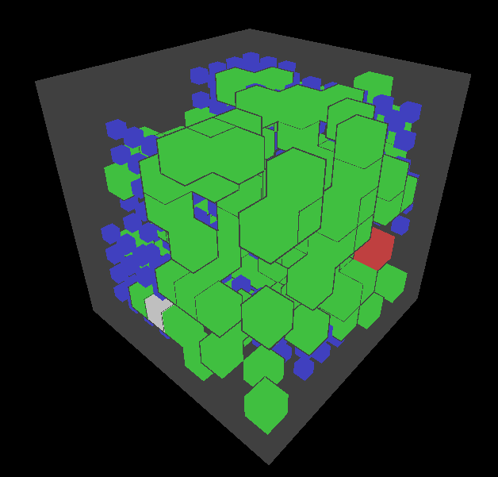
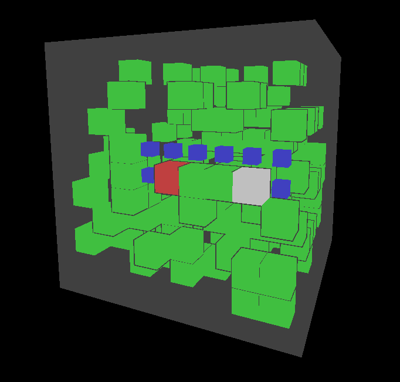

# 3D Maze Pathfinding

This is a 3D maze generator and pathfinding visualizer. It generates a random 3D maze and uses the [Dijkstra algorithm](https://en.wikipedia.org/wiki/Dijkstra's_algorithm/) to find the shortest path from a random start point (white cube) to a random end point (red cube) while navigating around walls (green cubes). The path is visualized with the smaller blue cubes. Built with [Three.js](https://threejs.org/), a 3D library for Javascript.

Visit [here](https://jwt2706.ca/3DMazePathfinding) to try it out!

Screenshots: 

## TODO:

- throw error if the maze is impossible (which can happen since the generation is random)
- fix the bug where the grey thing just leaves on restart